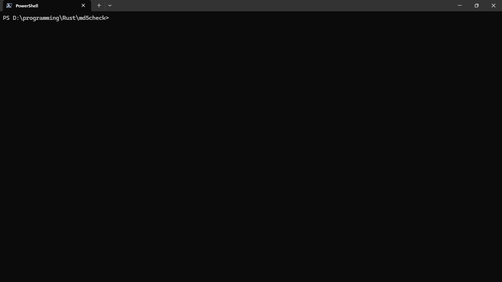

# md5check




A simple TUI program for verifying MD5 checksums with multithreading.

---

This program was primarily created for fun and to verify FitGirl Repacks faster using multithreading — but mainly for fun.

It is not guaranteed to be fast or highly efficient. It was designed to suit my needs and visual preferences.  

## Usage

First, clone the repository. 

```shell
git clone git@github.com:SuperCoolGuy855/md5check.git

```

Install using Cargo.

```shell
cargo install --path . --locked
```

Start up program.

```shell
md5check
```